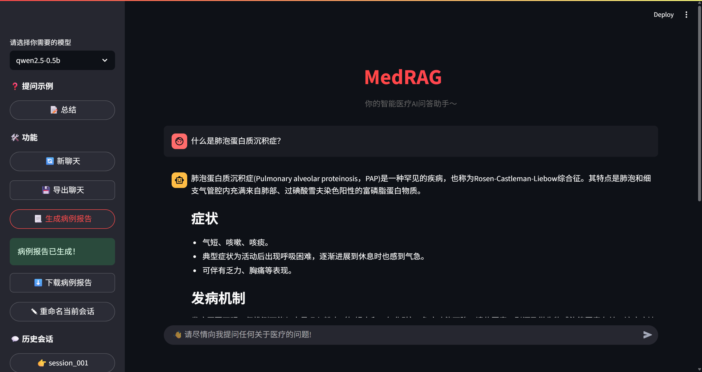
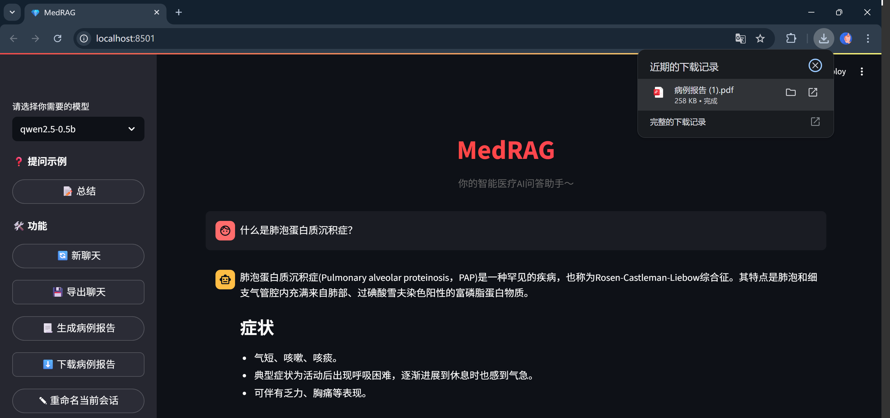
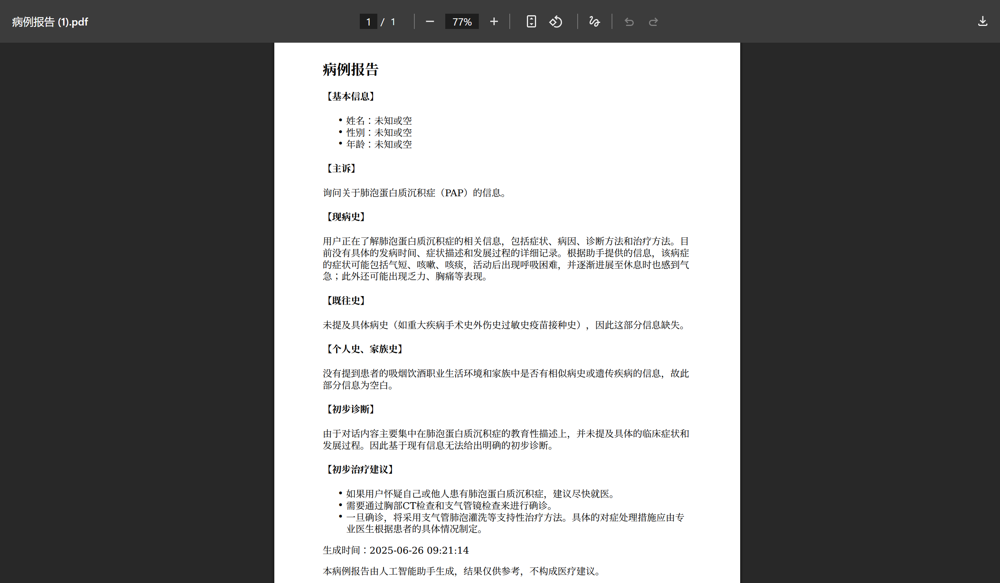

# 病例报告生成功能 - 开发记录
**负责成员：许琪、李思涵**

## 1. 需求背景

* **目标**：用户完成一次多轮问诊后，系统可一键生成病例报告（Markdown 或 PDF），并支持下载。
* **核心要素**

  1. **数据来源**：对话历史保存在 SQLite 数据库（`history/case.db`）。
  2. **生成逻辑**：调用 agent 根据对话历史生成病例。  

     * 从对话中抽取患者基本信息（姓名 / 性别 / 年龄），缺失则留空。
     * 根据对话自动组织【主诉】【现病史】等章节。
     * 追加生成时间与免责声明。
  3. **功能接口**：

     * `POST /generate_case_text` 返回 生成的病例 Markdown。
     * `POST /generate_case_pdf` 返回 生成的病例 PDF 文件流。
  4. **Streamlit 集成**:  

     * 在侧栏加入 “生成病例报告” 按钮，调用 FastAPI 接口根据当前用户的 `user_id` 和当前对话的 `session_id` 生成病例。  
     * 在侧栏加入 “下载病例报告” 按钮，生成病例完成后，调用 FastAPI 接口下载病例 PDF 文件。  

---

## 2. 技术方案

### 2.1 数据层

* **SQLite** ( 这部分基于李惠玲完成的多轮对话历史后端存储模块提供的接口 )

  * `utils/case_db.py` 的 `CaseStorage`类：封装 `save_message / get_messages / generate_case`。（我们统一将生成病例需要的处理封装成接口）
  * 连接参数 `check_same_thread=False`，解决 FastAPI 多线程访问报错。
  * `generate_case()` 去重并拼接 Markdown-ready 对话段落。

### 2.2 业务层 (FastAPI)

| 路径                    | 方法     | 说明                                               |
| --------------------- | ------ | ------------------------------------------------ |
| `/generate_case_text` | `POST` | 输入 `user_id + session_id` → 返回 `{"markdown": …}` |
| `/generate_case_pdf`  | `POST` | 同上 → 先生成 MD，再转 PDF，返回 `FileResponse`             |

* **生成流程**

  1. 读取对话：`context = case_db.generate_case(...)`
  2. 构造 Prompt（含空缺基本信息占位符）。
  3. 调用 `get_agent().run(prompt)` 获取 AI Markdown。
  4. 若生成 PDF：

     * 截去解释行：

       ```python
       if "## 病例报告" in md:
           md = md.split("## 病例报告", 1)[1]
           md = "## 病例报告" + md
       ```
     * `markdown2.markdown()` → HTML → `weasyprint.HTML.write_pdf()`
  5. 返回结果 / 文件流。
  
### 2.3 AI Prompt 关键片段

```text
## 病例报告

### 【基本信息】
- 姓名：<提取的姓名或空>
- 性别：<提取的性别或空>
- 年龄：<提取的年龄或空>

...
生成时间：{current_time}

本病例报告由人工智能助手生成，结果仅供参考，不构成医疗建议。
```

---

### 2.4 表现层

| 按钮                   | 说明     |
| --------------------- | ------ |
|📃 生成病例报告|调用`download_case() `，通过 FastAPI 接口生成病例|
|⬇️ 下载病例报告|点击实现病例的下载|

* **用户使用流程**
  1. 点击“生成按钮”，页面出现“正在生成病例报告...”的等待显示。此时调用download_case() ，通过 FastAPI 接口向后端请求 PDF 数据。
  2. 成功返回字节流后，前端页面显示“病例报告已生成！”的提示，此时出现“下载按钮”，可供用户下载病例。
  3. 用户点击“下载按钮”，浏览器自动下载生成的病例报告。
  
## 3. 关键代码变更

| 文件                      | 关键增改                                                                  |
| ----------------------- | --------------------------------------------------------------------- |
| `generate_case.py`      | + FastAPI 实例<br>+ 请求模型 `GenerateCaseRequest`<br>+ 两个 POST 接口实现        |
| `app.py`                 | + 两个按钮实现<br>+ 通过API向后端请求PDF数据<br>+ 多种提高用户体验的提示    |

## 4. 主要问题与解决

| 问题                                                                           | 解决方案                                                      |
| ---------------------------------------------------------------------------- | --------------------------------------------------------- |
| **SQLite 跨线程异常**<br>`SQLite objects created in a thread can only be used...` | 连接加 `check_same_thread=False`                             |
| `TypeError generate_case 参数不匹配`                                              | 将 `generate_case` 定义为类方法；调用时 `case_db.generate_case(...)` |
| `ValueError not enough values to unpack`                                     | 认识到 `generate_case` 返回字符串，删除 `(role, msg)` 解包逻辑           |
| PDF 前多出解释行                                                                   | 在生成 PDF 前对 Markdown 截断，保留 `## 病例报告` 之后内容                  |
| 在请求PDF数据时等待时间过长，需要给予用户适当的提示                               | 设置`spinner`，并创建`pdf_ready`的状态变量，及时返回病例生成的状态供用户参考      |
---

## 5. 测试

### 5.1 单元测试脚本

`python test_generate_case.py`

* 先请求 `/generate_case_text`，断言 HTTP 200、字段 `markdown` 存在。
* 再请求 `/generate_case_pdf`，保存为 `downloaded_case.pdf`，断言文件大小 > 0。查看 `downloaded_case.pdf` 文件。  

### 5.2 人工验证

* 完成一轮对话  
* 点击 “生成病例报告” 按钮，等待前端显示 “病例报告已生成!”  



* 点击 “下载病例报告” 按钮    

  

PDF 字首应从 `## 病例报告` 开始。**缺失姓名/性别/年龄** 时字段显示 “未知或空”。除病例报告关键字段外包含 生成时间 和 AI免责声明。



---

## 6. 下一步计划

| 优化项              | 说明                                           |
| ---------------- | -------------------------------------------- |
| **提取患者信息的精细化**   | 可在保存消息时标注实体或使用正则初筛，减少大模型成本                   |
| **报告样式**         | 自定义 CSS，页眉页脚、Logo、分页                         |
| **异步任务队列**       | 大模型 & PDF 生成时间较长，可接入 Celery + Redis，前端轮询任务状态 |
| **安全**           | 增加身份验证、速率限制、防止越权读取其他用户病例                     |

---

**日期**：2025-06-26
