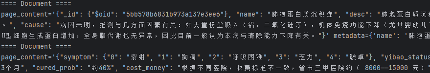

# 基于RAG的Agno智能体初步搭建
**负责成员：陈沁文**

负责实现agno基础框架以及RAG初步pipeline搭建，包含向量数据库创建、模型部署以及检索器的构建和优化，初步运行跑通项目。

## 环境配置
python环境：python3.12

主要用到的框架和库：agno、ollama、langchain、faiss

创建并激活虚拟环境后启动ollama服务,检查ollama监听端口11434。
```shell
ollama serve
curl http://localhost:11434
```

## faiss向量数据库创建及检索器优化
注意安装版本必须为'-cu12',没有会报错找不到版本，换国内镜像源加速下载。
```shell
pip install faiss-gpu-cu12
```
安装langchain以及相关依赖，其中langchain_community包含第三方集成（faiss），langchain_ollama涉及langchain关于ollama的集成。
```shell
pip install langchain langchain-community langchain_ollama
```

Embedding model选择bge-m3,通过ollama部署以及调用
>bge-m3 Embedding模型以其在多语言、多功能和多粒度方面的多功能性而著称。它支持超过100种语言，在多语言和跨语言检索任务中取得了卓越的性能。它可以同时执行嵌入模型的三种常见检索功能：密集检索、多向量检索和稀疏检索，为现实世界的信息检索应用提供了统一的模型基础。它能够处理不同粒度的输入，从短句到多达8192个token的长文档。

ollama拉取bge-m3模型
```shell
ollama pull bge-m3
```

接下来实现知识库文档medical.json的向量化并存储到本地faiss向量数据库。

考虑到medical.json的数据结构，单条字典对应一种疾病的所有信息，文本长度较长，若以一般的递归分块方式进行文档切分，容易将同种疾病的信息分散在多个分块中，不利于召回的完整性。
如下图所示，肺泡蛋白质沉积症的描述和症状等信息分散在了两个分块，第二个分块缺失所属疾病名称的信息，不易被检索到（即使设置max chunk size=2000该条目仍被分为两个分块）。


因此检索器采用langchain的multivector retriever（多向量检索器），将单个疾病条目（即一个字典）视作父文档，对应的子文档为其分块结果，通过向量化和检索子文档，最终召回所属的父文档，提高召回率，保证上下文信息的完整性。
具体实现代码如下,子文档faiss向量数据库存储路径为当前路径/vs,父文档存储路径为当前路径/docs,子文档分块策略为递归分块，最大分块大小设置为2000。父文档与子文档之间的映射关系通过生成的uuid并作为索引实现。
```python
import json
from pathlib import Path
from langchain_core.documents import Document
from langchain_text_splitters import RecursiveJsonSplitter
from langchain_ollama import OllamaEmbeddings
from langchain.storage import LocalFileStore
from langchain_community.docstore.in_memory import InMemoryDocstore
from langchain_community.vectorstores import FAISS
from langchain.retrievers.multi_vector import MultiVectorRetriever
import uuid
import faiss
from tqdm import tqdm


splitter = RecursiveJsonSplitter(max_chunk_size=2000)
embedding_model = OllamaEmbeddings(model="bge-m3")
vs_docs_path = Path.cwd() / "docs"
vs_path = Path.cwd() / "vs"
docs_store = LocalFileStore(vs_docs_path)

# 确定距离向量索引
index = faiss.IndexFlatL2(len(embedding_model.embed_query("test")))
vectorstore = FAISS(
    embedding_function=embedding_model,
    index=index,
    docstore=InMemoryDocstore(),
    index_to_docstore_id={}
)

id_key = "doc_id"
retriever = MultiVectorRetriever(
    vectorstore=vectorstore,
    docstore=docs_store,
    id_key=id_key,
)


with open("./doc/medical.json", "r", encoding="utf-8") as f:
    total_lines = sum(1 for _ in f)

with open("./doc/medical.json", "r", encoding="utf-8") as f:
    for line in tqdm(f, total=total_lines, desc="Building FAISS index"):
        entry = json.loads(line)
        # 提取元数据
        doc_id = str(uuid.uuid4())
        metadata = {
            id_key: doc_id,
            "name": entry.get("name", ""),
            "category": ",".join(entry.get("category", [])),
        }

        sub_docs = splitter.create_documents(
            texts=[entry],
            convert_lists=True,  # 推荐设为 True：能将 list 转换为 dict，便于嵌套处理
            ensure_ascii=False,
            metadatas=[metadata],
        )
        retriever.vectorstore.add_documents(sub_docs)
        retriever.docstore.mset([(doc_id, str(entry).encode())])

        vectorstore.save_local(vs_path)

# 输出统计信息
print(f"\n 当前向量分块数量: {vectorstore.index.ntotal}")
print(f" 索引到文档ID映射数: {len(vectorstore.index_to_docstore_id)}")
```


首先只向量化前两条数据进行测试，测试代码如下：
```python
import json
from pathlib import Path
from langchain_ollama import OllamaEmbeddings
from langchain_community.vectorstores import FAISS
from langchain.retrievers.multi_vector import MultiVectorRetriever
from langchain.storage import LocalFileStore

vs_path = Path.cwd() / "vs"
vs_docs_path = Path.cwd() / "docs"
embedding_model = OllamaEmbeddings(model="bge-m3")
vectorstore = FAISS.load_local(vs_path, embedding_model, allow_dangerous_deserialization=True)
docstore = LocalFileStore(vs_docs_path)
retriever = MultiVectorRetriever(
    vectorstore=vectorstore,
    docstore=docstore,
    id_key="doc_id",
)

# 进行查询测试
query = "出现呼吸困难怎么办？"
results = retriever.invoke(query)

for i, raw_bytes in enumerate(results):
    print(f"\n--- 原始文档 {i+1} ---")
    decoded = raw_bytes.decode("utf-8")
    # 转换为 JSON 对象（字典）
    try:
        doc_dict = eval(decoded)
        print(json.dumps(doc_dict, indent=2, ensure_ascii=False))
    except Exception as e:
        print("⚠️ 解码失败:", e)


# 遍历 vectorstore 中的所有分块，
print(f"📦 当前向量数量: {vectorstore.index.ntotal}")
print(f"🔗 索引到文档ID映射数: {len(vectorstore.index_to_docstore_id)}")

for i in range(vectorstore.index.ntotal):
    doc_id = vectorstore.index_to_docstore_id[i]
    doc = vectorstore.docstore.search(doc_id)

    print(f"\n--- Chunk {i+1} ---")
    print(f"🆔 文档ID: {doc_id}")
    print(f"📄 内容片段:\n{doc.page_content[:300]}...")
    print(f"📎 元数据: {doc.metadata}")
```
下面两张图分别是查询测试的召回文档和向量库所有分块的情况，可以看出测试召回2个完整数据条目，而不是分块，向量库分块总数为7，metadata中的metadata doc_id仅两种，与父文档相对应，说明代码逻辑符合multivector retriever。


最后完成整个知识文档的向量化，用时1h，向量数据库信息如下

## 结合RAG的自适应检索Agno agent初步搭建
安装agno
```shell
pip install -U agno
```
首先，明确关于agent设计的构想  
|功能|说明|
|---|---|
|普通对话|统一管理上下文，保留对话历史，包含历史检索召回结果|
|自适应检索，判断是否需要检索|设计prompt COT判断是否需要检索，无需检索的情况包括用户再次的询问可基于已有对话历史回答，或者用户输入不是查询，而是回答模型的引导问题（不过在补充了病症信息后可能也需要新的检索补充知识），还有用户输入要求生成或者点击交互按钮要求生成报告，这种情况也无需检索，属于总结|
|检索后回答|依据召回知识回答|
|引导提问/收集更多信息，结尾生成引导信息|在回答后自动建议用户补充什么症状|
|病例总结/报告生成|模型用历史对话调用生成工具，markdown，在streamlit界面可供下载|

接下来完成自适应检索agent。
起初认为需要构建两个agent，一个负责判断是否需要检索，一个负责实际检索；但在实现过程中发现仅需一个agent即可，该agent在判断需要检索后调用检索工具retrieve_medical完成RAG过程。
其中retrieve_medical是需要实现的函数，agent基于查询和对话历史在判断需要检索后会通过推理自动提取用于检索的查询语句，作为参数query传入retrieve_medical并调用，retrieve_medica在faiss向量数据库检索召回相关的知识文档作为输入生成模型的上下文，最终指导模型回答。

此处的retrieve_medical我仅完成了基础的检索和上下文返回功能，后续RAG优化由其他同学负责。

生成模型（DEFAULT_MODEL）选择qwen2.5:14b-instruct-fp16，同样需要通过ollama拉取和调用。TOP_K设置为2。
```shell
ollama pull qwen2.5:14b-instruct-fp16
```
>Qwen2.5是一系列全面的大型语言模型 (LLM)，旨在满足多样化需求。与之前的版本相比，Qwen 2.5 在训练前和训练后阶段都得到了显著改进。instruct是经过指令微调的版本，专门用于理解和执行特定的指令。它在通用语言模型的基础上，增加了对指令的理解和执行能力，使其更适合处理指令式的任务，如生成特定格式的文本、回答特定类型的问题等。

agent代码如下
```python
# agent.py
from agno.agent import Agent
from agno.models.ollama import Ollama
from agno.tools.reasoning import ReasoningTools
from config.settings import DEFAULT_MODEL, VS_PATH, VS_DOCS_PATH, EMBEDDING_MODEL, TOP_K, SEARCH_TYPE
from langchain_ollama import OllamaEmbeddings
from langchain_community.vectorstores import FAISS
from langchain.retrievers.multi_vector import MultiVectorRetriever
from langchain.storage import LocalFileStore
from typing import Annotated
import json
import logging
from textwrap import dedent

logger = logging.getLogger(__name__)

# 初始化向量数据库组件一次，避免每次调用都重复加载
embedding_model = OllamaEmbeddings(model=EMBEDDING_MODEL)
vectorstore = FAISS.load_local(VS_PATH, embedding_model, allow_dangerous_deserialization=True)
docstore = LocalFileStore(VS_DOCS_PATH)
retriever = MultiVectorRetriever(
    vectorstore=vectorstore,
    docstore=docstore,
    id_key="doc_id",
    search_type=SEARCH_TYPE,
    search_kwargs={"k": TOP_K},
)

def retrieve_medical(query: Annotated[str, "需要查询的医学问题"]) -> str:
    results = retriever.invoke(query)
    contexts = []
    for raw_bytes in results:
        try:
            decoded = raw_bytes.decode("utf-8")
            doc_dict = eval(decoded)
            contexts.append(json.dumps(doc_dict, ensure_ascii=False))
        except Exception as e:
            logger.warning(f"解码失败: {e}")
    return "\n\n".join(contexts) if contexts else "未找到相关医学资料。"


def get_agent(model_id: str = DEFAULT_MODEL, session_id=None, user_id=None) -> Agent:
    return Agent(
        name="Medical Assistant",
        model=Ollama(id=model_id),
        instructions=dedent("""\
                        你是一个智能助手，可以回答用户的各种问题。
                        向量数据库数据来源权威的医药网站“寻医问药”网，处理成结构化数据
                        数据示例：
                        {
                        "name": "肺泡蛋白质沉积症",
                        "desc": "肺泡蛋白质沉积症(简称PAP)...男性发病约3倍于女性。",
                        "category": ["疾病百科","内科","呼吸内科"],
                        "prevent": "1、避免感染分支杆菌病...因此目前一般认为本病与清除能力下降有关。",
                        "symptom": ["紫绀","胸痛","呼吸困难","乏力","毓卓"],
                        "acompany": ["多重肺部感染"],
                        "cure_department": ["内科","呼吸内科"],
                        "cure_way": ["支气管肺泡灌洗"],
                        "check": ["胸部CT检查","肺活检","支气管镜检查"],
                        "recommand_drug":...,
                        "drug_detail":...
                        }
                        如果你认为用户当前的问题无法凭借自身内部知识直接回答，需要检索类似上述的医学知识，那么使用retrieve_medical工具，例如：retrieve_medical(query)，否则无需检索直接回答\
                    """),
        tools=[ReasoningTools(add_instructions=True), retrieve_medical],
        show_tool_calls=True,
        markdown=True,
    )
```
运行main.py文件测试
```python
# main.py
from models.agent import get_agent

if __name__ == "__main__":

    agent = get_agent()
    # user_input = "什么是病毒性心肌炎？"
    user_input = "中国的首都在哪？"
    res = agent.run(user_input)
```
两个测试问题前者需要检索，后者不需要：1.  "什么是病毒性心肌炎？" 2. "中国的首都在哪？"。

测试效果如下，可以看到agent可以实现该意图分类，调用相应的工具。


## 心得体会
在项目初期，我们原计划基于 Open-WebUI 展开开发，但在实际实现过程中遇到诸多技术障碍。根据李老师在最终汇报中的建议，我们转而选择了 Agno 作为核心框架。通过对 Agno 的学习与实践，我深入了解了 Agent 的构建逻辑，包括如何自定义工具函数、优化提示词以实现多工具灵活调用、管理和调用多轮对话历史等。此前我仅接触过 RAG 和 LLM，本次实践不仅激发了我对 Agent 架构的浓厚兴趣，也拓宽了我在 NLP 与 AI 应用方向的视野，对我未来的学习和研究具有重要意义。

在项目推进过程中，我们小组成员积极沟通、密切协作，大家分工明确、互相配合，不仅有效推动了项目进展，也让我深刻体会到团队合作的力量。

非常感谢老师和助教在整个过程中的耐心指导与专业帮助，以及组内每一位同学的支持与努力。
